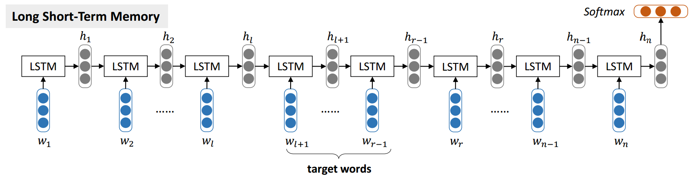
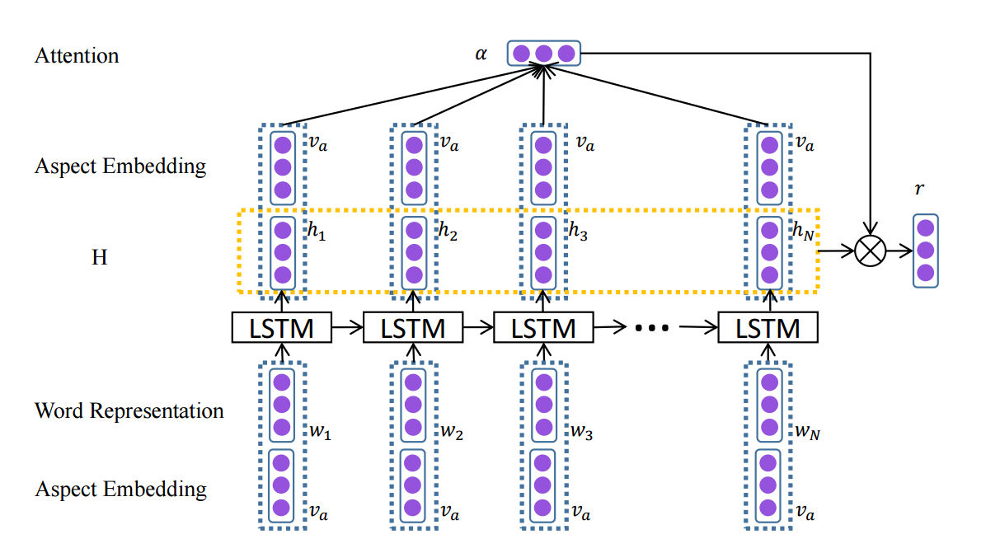
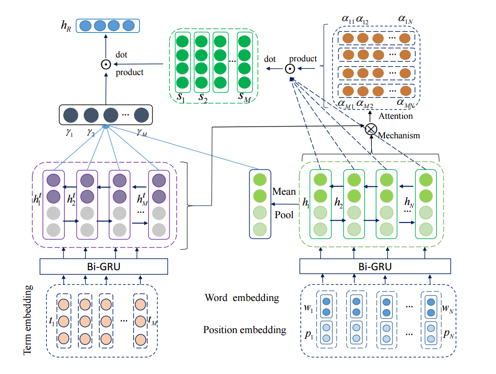

# PBAN-PyTorch

> [PyTorch](https://pytorch.org/) implementation of [Gu et al.'s COLING 2018](https://aclweb.org/anthology/C18-1066) work.

[](LICENSE)

## Requirement

* PyTorch >= 0.4.0
* NumPy >= 1.13.3
* Python 3.6
* GloVe pre-trained word vectors:
  * Download pre-trained word vectors [here](https://github.com/stanfordnlp/GloVe#download-pre-trained-word-vectors).
  * Extract the [glove.twitter.27B.zip](http://nlp.stanford.edu/data/wordvecs/glove.twitter.27B.zip) and [glove.42B.300d.zip](http://nlp.stanford.edu/data/wordvecs/glove.42B.300d.zip) to the `glove` directory.

## Dataset

Based on the restaurant and laptop dataset of [SemEval-2014 Task 4](http://alt.qcri.org/semeval2014/task4/).

### Restaurant Dataset

| Polarity | #Train | #Test |
| -------- | ------ | ----- |
| Positive | 2164   | 728   |
| Negative | 807    | 196   |
| Neutral  | 637    | 196   |

### Laptop Dataset

| Polarity | #Train | #Test |
| -------- | ------ | ----- |
| Positive | 994    | 341   |
| Negative | 870    | 128   |
| Neutral  | 464    | 169   |

## Usage

```sh
python train.py
```

## Implemented models

### LSTM

Tang, Duyu, et al. "Effective LSTMs for Target-Dependent Sentiment Classification." Proceedings of COLING 2016, the 26th International Conference on Computational Linguistics: Technical Papers. 2016. [[pdf]](https://arxiv.org/pdf/1512.01100)



### ATAE-LSTM

Wang, Yequan, Minlie Huang, and Li Zhao. "Attention-based LSTM for aspect-level sentiment classification." Proceedings of the 2016 conference on empirical methods in natural language processing. 2016. [[pdf]](http://www.aclweb.org/anthology/D16-1058)



### PBAN

Gu, Shuqin, et al. "A Position-aware Bidirectional Attention Network for Aspect-level Sentiment Analysis." Proceedings of the 27th International Conference on Computational Linguistics. 2018. [[pdf]](http://www.aclweb.org/anthology/C18-1066)



## Performance

### Restaurant Dataset

#### Three-class

| Model     | In Paper | This Code |
| --------- | -------- | --------- |
| LSTM      | 74.28    | 77.68     |
| ATAE-LSTM | 77.20    | 78.30     |
| PBAN      | 81.16    | 80.18     |

#### Two-class

| Model     | In Paper | This Code |
| --------- | -------- | --------- |
| LSTM      | -        | -         |
| ATAE-LSTM | 90.90    | 90.26     |
| PBAN      | 91.67    | 92.32     |

### Laptop Dataset

#### Three-class

| Model     | In Paper | This Code |
| --------- | -------- | --------- |
| LSTM      | 66.45    | 71.00     |
| ATAE-LSTM | 68.70    | 71.32     |
| PBAN      | 74.12    | 73.82     |

#### Two-class

| Model     | In Paper | This Code |
| --------- | -------- | --------- |
| LSTM      | -        | -         |
| ATAE-LSTM | 87.60    | 87.63     |
| PBAN      | 87.81    | 87.42     |

## Acknowledgements

* Some of the code is borrowed from [songyouwei](https://github.com/songyouwei/ABSA-PyTorch).
* Using this code means you have read and accepted the copyrights set by the dataset providers.

## License

MIT